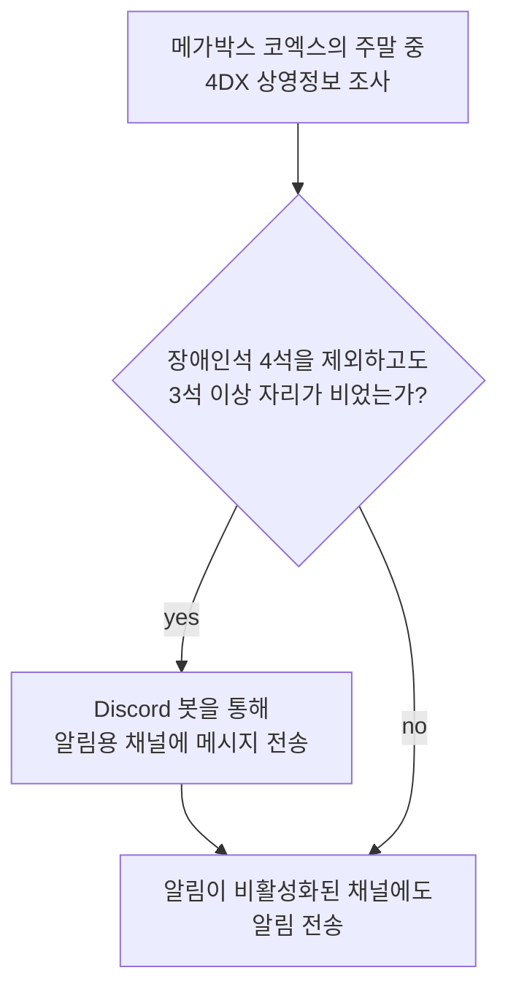

# 개요

MEGABOX의 API를 사용하여 **진격의 거인 극장판** 4DX 상영관이 주말에 열리는지를 주기적으로 확인하는 디스코드 알림 봇을 만들자.

## 배경

친구들과 같이 [진격의 거인 극장판](https://namu.wiki/w/극장판%20진격의%20거인%20완결편%20더%20라스트%20어택)을 (입체기동) **4DX**로 보러가자는 이야기가 나왔으나, 모두가 가능한 시간대가 주말, 일부 시간대밖에 없다는 점을 발견.

해당 시간은 대부분 (장애인석을 제외하고) 전석 매진인 경우가 많아 곤란한 상황.

# 동작 원리

## 사용하는 API

-   "**특정일**"에 "**특정 극장**"에서 "**특정 영화**의 상영 정보를 가져오는 API가 존재한다. 이를 활용하도록 한다.

    -   **특정 영화**: 당연히 진격의거인이다: `25008000`
    -   **특정일**: 주말에 해당하는 날짜는 모두 조사한다.
    -   **특정 극장**:
        -   진격의 거인을 4DX로 상영하는 극장은 세 곳 밖에 없다.
            -   코엑스: `1351`
            -   수원AK플라자(수원역): `4651`
            -   하남스타필드: `0052`
        -   친구들의 동선상 코엑스가 압도적으로 이상적이기에 코엑스를 조사한다.

## 파악하고 나면

## 자동 워크플로

위 과정을 한국시간 기준으로 09시 부터 23시까지 매 시간 간격으로 조사한다.

-   GitHub Actions를 사용하며, Trigger로 cron에 의한 schedule 방식을 통해 이를 실현한다.

-   Discord 봇을 사용하기 위한 봇 토큰은 REPOSITORY SECRET 으로 관리되며, 워크플로 작업이 시작되면 Python 애플리케이션에 환경변수 형태로 전달된다.

# 비고

## 왜 크롤링을 해야하죠?

예매가 추가적으로 열리길 기대해야하는 상황인데, 예매가 열리는 정도와 시기는 극장마다 상이하다고 공지되어 있는 상황.
그러나, 예매가 언제 열리는지, 얼마나 열리는지, 열리긴 하는지는 별도로 공지되지 않는다.

즉, 매 순간 예매가 열렸는지 직접 확인해보다가 우연히 열려있으면 재빠르게 예매하는 수 밖에 없다.

업무 시간상 새벽에 예매가 열리진 않을 것으로 판단하고, 09~23시에 **상영 정보를 1시간 간격으로 반복 조사하기로 결정**.

**상영정보 조사를 위해 크롤링을 하게 되었고**, 이 작업의 반복은 GitHub Actions(무료 사용분)을 이용하여 자동화 한다.

## 왜 디스코드죠?

최신 트렌드는 슬렉 봇을 많이 활용하는 추세인 것으로 보이나, 이는 (개발 직군 계열) 직장인들에 해당한다고 생각한다.

본 작업은 **대학생 모임**의 편의성을 위한 봇으로, **사용자의 편의성과 접근성을 고려하여 디스코드로 알림을 보내기로 결정**.

## 왜 Python (discord.py) 로 작성되었나요?

떠오른 아이디어를 빠르게 구현하는 건 파이썬이 가장 적합한 언어라고 생각하여 채택.

### 사실 공식 API를 사용해보려 했다

실행 주기동안 특정 채널에 메시지 1건만 보내면 되므로, Vanilla Python + REST/WebSocket API를 통해서 작업을 시도해보려 했다.

### HTTP API 문서를 찾기 어려웠다

메시지 단 건을 전송하는 HTTP API를 쓸 수 있었으면 최상이었겠지만, 관련된 내용을 공식 문서에서 찾기 쉽지 않았다. HTTP API 같은 것이 있다고 언급만 되어있고 사용법이 직관적으로 명시되어 있지 않았다.

### Gateway (WebSocket) API 를 시도는 해보았다

따라서, discord에서 공식으로 제공하는 [Websocket Gateway API](https://discord.com/developers/docs/events/gateway#connections) 를 사용해보려 하였다. State Machine 형태로 구현하여, Identify 작업까지 수행해 Ready (opcode: 0) 상태를 확인하는 것까지 진행했으나,

Discord 공식 API는 문서화가 잘 되어있지 않고, 정보를 찾아보는 과정에서 불필요하게 개발 시간이 늘어지는 것 같아서 라이브러리 사용을 결정했다.
